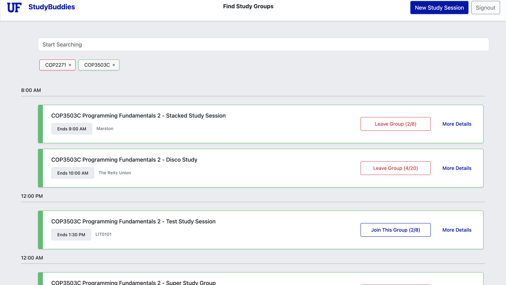
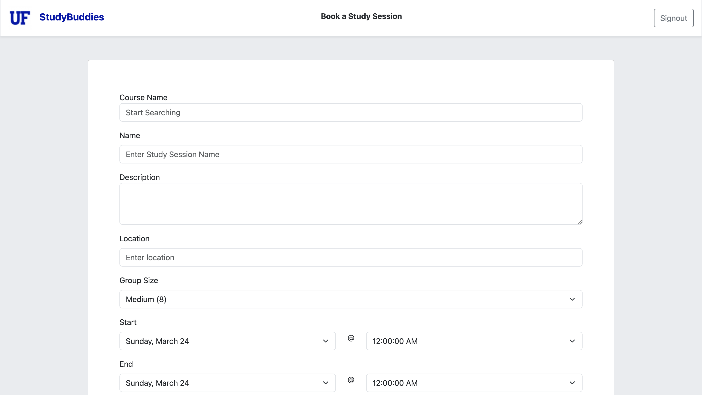

# Study Buddies

> Hackathon Submission: [Devpost](https://devpost.com/software/study-buddies-brqelk)

### Demo

> **Try it out live!**: [Study-buddy.vercel.app](https://study-buddy-git-main-jongroberg.vercel.app/welcome)

> Test with **login**: `test@gmail.com` and **password**: `password` OR create a new account



## 💡 Inspiration

The inspiration behind Study Buddies stemmed from the realization that finding study groups and like-minded individuals to collaborate with can greatly enhance the learning experience. As students ourselves, we recognized the importance of peer support and the positive impact it can have on academic success. We wanted to create a platform that would make it easier for students at the University of Florida (UF) to connect with study groups and foster a collaborative learning environment.

## What it does

Study Buddies is a platform designed to help students at UF find study groups tailored to their needs. It provides a user-friendly interface where students can create study group profiles, search for existing study groups, and connect with other students who share similar academic interests. Additionally, Study Buddies offers features such as group messaging, file sharing, and event scheduling to facilitate effective communication and coordination within study groups.



## 🏗️ How we built it

Study Buddies was built using a combination of modern web development technologies. The frontend of the platform was developed using Astro, React, Figma, and , providing an intuitive and responsive user interface. For the backend, we utilized a Astro and Firebase, which allowed us to handle user authentication, database management, and efficient data retrieval.

## Challenges we ran into

Throughout the development process, we encountered several challenges. One of the main hurdles was designing an intuitive user interface that would cater to the diverse needs of UF students. We conducted extensive user research and iterative testing to ensure that the platform was user-friendly and provided a seamless experience.

## 🏆 Accomplishments that we're proud of

We are proud to have created Study Buddies, a platform that addresses the critical need for study group formation at UF. We successfully implemented a range of features that facilitate effective collaboration among students, streamlining the process of finding and connecting with study groups. Our user-centric design approach and extensive testing resulted in an intuitive and accessible platform that enhances the learning experience for UF students.

## 🧑‍🎓 What we learned

Throughout the development of Study Buddies, we gained valuable insights into the complexities of building a web application that caters to a specific user base. We honed our skills in frontend and backend development, database management, and API integration. We also learned the importance of incorporating user feedback and conducting usability testing to create a product that truly meets the needs and expectations of its users.

## What's next for Study Buddies

Looking ahead, we have exciting plans to further enhance and expand Study Buddies. Some of the future developments include:

1. Implementing advanced search filters to help students find study groups based on specific criteria such as course, location, or study preferences.
2. Developing a mobile application for Study Buddies to provide students with on-the-go access and convenience.

## 💻 Installing/Usage

### Install

```shell
git clone https://github.com/JonCGroberg/study-buddy
```

### Build/Run

| Command                   | Action                                           |
| :------------------------ | :----------------------------------------------- |
| `npm install`             | Installs dependencies                            |
| `npm run dev`             | Starts local dev server at `localhost:4321`      |
| `npm run build`           | Build your production site to `./dist/`          |
| `npm run preview`         | Preview your build locally, before deploying     |
| `npm run astro ...`       | Run CLI commands like `astro add`, `astro check` |
| `npm run astro -- --help` | Get help using the Astro CLI                     |
